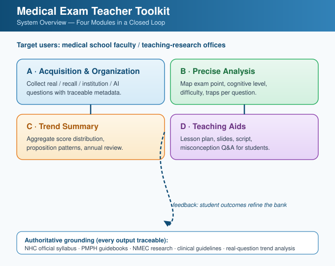
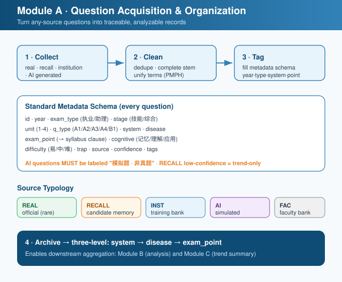
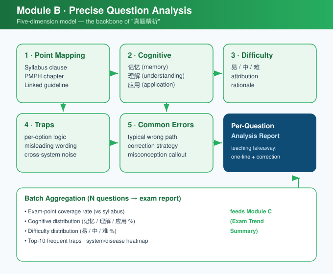
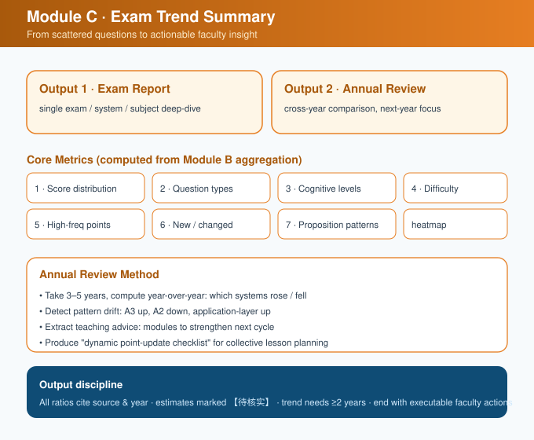
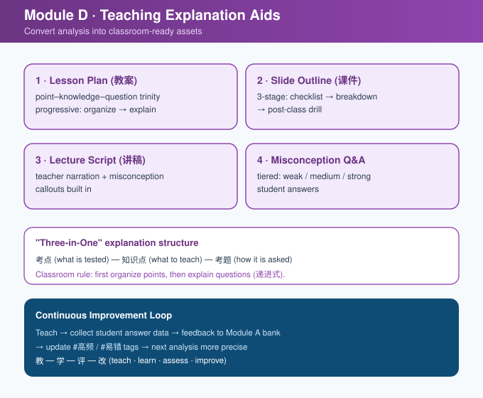
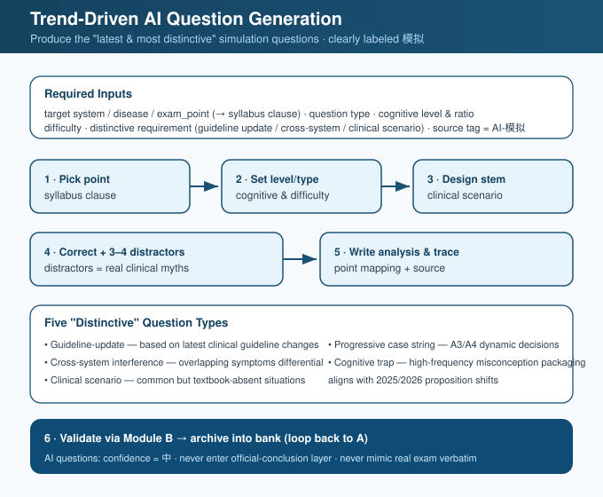
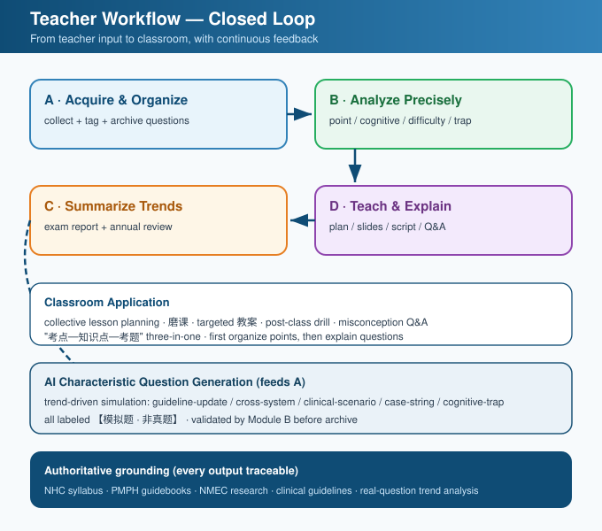

# Medical Exam Teacher Toolkit

> A professional, authoritative toolkit for **medical school faculty** to acquire, analyze, summarize, and teach **Chinese Clinical Physician Licensing Examination** (临床执业医师 / 助理医师资格考试) questions.

中文说明见 [README.md](README.md)。

---

## Why this exists

Medical educators run teaching-research activities — collective lesson planning, lesson polishing, real-question deep-dives, score analysis. They need to:

1. **Acquire the latest and most distinctive questions** (real / recall / institution / AI-generated)
2. **Analyze** each question precisely: exam point, cognitive level, difficulty, traps
3. **Summarize** exam trends: score distribution, proposition patterns, annual review
4. **Translate analysis into teaching** that explains questions to students

This Skill turns that work into a repeatable, authoritative, traceable workflow — and clearly separates real questions from simulated ones.

## Four modules (closed loop)

| Module | Function | Key output |
|--------|----------|------------|
| **A · Acquisition & Organization** | structured collection + metadata tagging | traceable question records |
| **B · Precise Analysis** | exam-point / cognitive / difficulty / trap / error | per-question analysis report |
| **C · Trend Summary** | score distribution / types / cognitive / annual | exam report + trend review |
| **D · Teaching Aids** | lesson plan / slides / script / Q&A | classroom-ready assets |

**Loop:** input → A (bank) → B (analyze) → C (summarize) → D (teach) → student feedback refines the bank.

AI-generated characteristic questions (Module D) flow back into A to supplement limited real questions.

## Authoritative grounding

Every output is traceable, in priority order:
1. NHC official syllabus (《医师资格考试大纲（2024年版）》) + 2026 medical-humanities revision
2. PMPH (人卫版) guidebooks / 10th-edition textbooks
3. NMEC (医考中心) research reports & innovation applications
4. Chinese Medical Association clinical practice guidelines
5. Real-question trend analysis (institutions / faculty research, cited)

> Unsourced official figures are marked `【待核实】`. AI questions are labeled `【模拟题 · 非真题】` (simulated, not real).

## File map

```
medical-exam-teacher-toolkit/
├── SKILL.md
├── references/      # 8 guides (system, bank, analysis, cognitive, trend, AI-gen, teaching, sources)
├── templates/       # 8 templates (record, analysis, report, review, AI-q, plan, slide, Q&A)
├── examples/        # 4 worked examples
└── docs/images/     # 7 SVG flowcharts
```

### Flowcharts (docs/images/)

#### System overview: four-module loop


#### Module A flow


#### Module B: five-dimension analysis


#### Module C: trend summary


#### Module D: teaching aids


#### Trend-driven AI question generation


#### Full teacher workflow loop


## Who it is for

- Medical school faculty, teaching-research offices, physician-exam training leads
- Teams pursuing "exam-teaching integration" and "real-question thinking in the classroom"

> For **students** preparing for the exam, use the companion `medical-exam-prep` skill.

## License

MIT — see [LICENSE](LICENSE).
